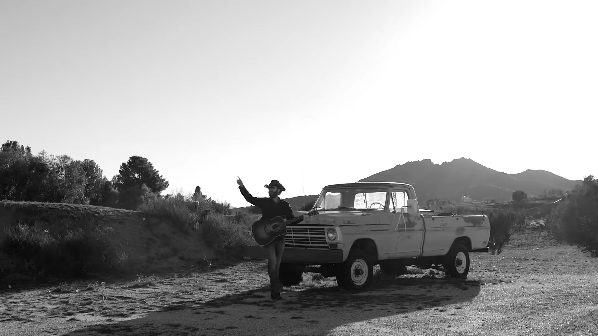
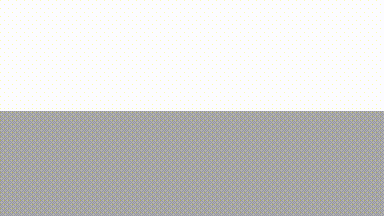

# Image to SVG

Convert raster images to geometrical primitives. Implemented using C# and [**Skia Sharp**](https://github.com/mono/SkiaSharp).

### Original



### Recreated with 2000 shapes



## Features

-   Set number of generated shapes
-   Downscale image before processing
-   Specify parameters of generation:
    -   Count of new shapes per step
    -   Number of mutations
    -   Number of generations
-   Save as `.svg` file
-   Save generation progress as `.webm` file

## Getting started

### Prerequisites

The project is written in **C#**, so [.NET 6.0 or higher](https://dotnet.microsoft.com/en-us/download) is needed. Some third-party packages are used, that can be downloaded with the following command:

```
dotnet restore
```
